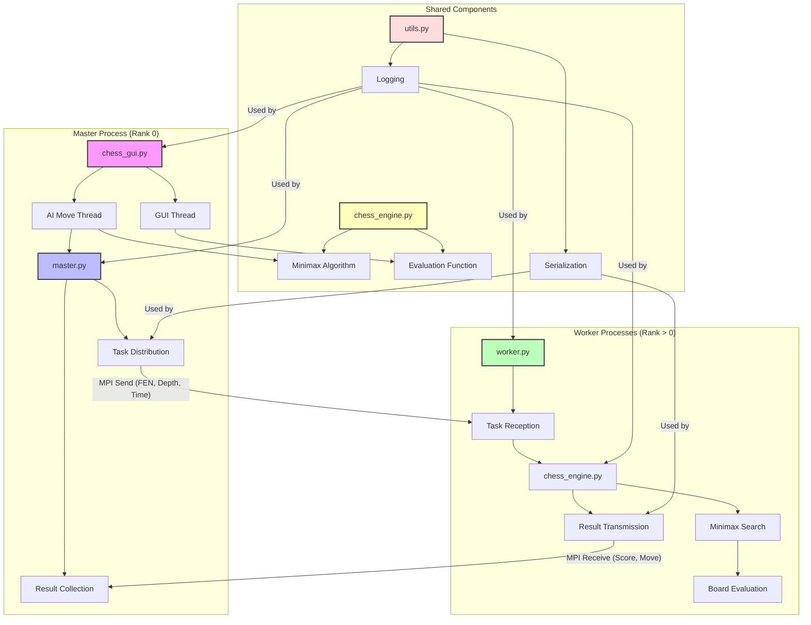

The command you provided, `mpirun -n 8 --oversubscribe python chess_gui.py`, is a valid way to run your Distributed Chess Engine with 8 MPI processes (1 master + 7 workers), using the `--oversubscribe` flag to allow more processes than available CPU cores. Below, I'll clarify how to increase the number of nodes/processes, explain the `--oversubscribe` flag, and update the `README.md` to incorporate this instruction. I'll also ensure the Mermaid diagram remains consistent and address any potential issues with scaling the number of nodes.

### Clarification on Increasing Number of Nodes

- **`-n 8`**: Specifies 8 MPI processes (1 master process for `chess_gui.py` and 7 worker processes). To increase the number of nodes (processes), simply increase this number, e.g., `-n 16` for 1 master + 15 workers.
- **`--oversubscribe`**: Allows running more MPI processes than available CPU cores. Without this flag, MPI may fail if the number of processes exceeds the core count (e.g., on a 4-core machine, `-n 8` might fail).
- **Scaling Considerations**:
  - The number of workers (\( W = n - 1 \)) should ideally be less than or equal to the number of legal moves at the root (~35 in chess) for optimal load balancing, as each worker evaluates one move's subtree.
  - Beyond ~35 workers, some may idle, reducing efficiency.
  - Memory and communication overhead increase with more processes, so test performance on your system.

**Example Commands**:
- For 12 processes (1 master + 11 workers):
  ```bash
  mpirun -n 12 --oversubscribe python chess_gui.py
  ```
- For 20 processes:
  ```bash
  mpirun -n 20 --oversubscribe python chess_gui.py
  ```

**Note**: On a cluster (multiple physical nodes), you may need additional MPI flags like `--hostfile` or `--host` to specify nodes. For a single machine, `--oversubscribe` is sufficient.

### Potential Issues
- **Resource Limits**: Too many processes may exhaust memory or CPU, especially if each worker logs extensively (`rank_X.txt` files).
- **Communication Overhead**: More workers increase MPI send/receive calls, potentially slowing down task distribution.
- **Load Imbalance**: If the number of moves is less than the number of workers, some workers will be idle.

### Updated README.md

Below is the updated `README.md`, incorporating instructions for increasing the number of nodes and clarifying the use of `--oversubscribe`. The Mermaid diagram remains unchanged, as it accurately represents the architecture regardless of the number of workers. I've also refined the usage section for clarity.

---

# Distributed Chess Engine Using MPI


A distributed chess engine built with Python, leveraging the Message Passing Interface (MPI) for parallel computation of chess moves. The engine uses a minimax algorithm with alpha-beta pruning, distributed across multiple processes, and features a graphical user interface (GUI) powered by Pygame. Play chess against an AI with configurable difficulty levels, visualize moves, and explore parallel computing in action.

## Table of Contents
- [Features](#features)
- [Architecture](#architecture)
- [Prerequisites](#prerequisites)
- [Installation](#installation)
- [Usage](#usage)
- [Project Structure](#project-structure)
- [Configuration](#configuration)
- [Contributing](#contributing)
- [License](#license)

## Features
- **Distributed Minimax Search**: Parallelizes chess move computation using MPI, speeding up the minimax algorithm with alpha-beta pruning.
- **Interactive GUI**: Built with Pygame, offering a user-friendly chessboard with move highlights, promotion dialogs, and game status updates.
- **Configurable Difficulty**: Three levels (Easy, Medium, Hard) with adjustable search depth and time limits.
- **Advanced Evaluation**: Considers material, piece-square tables, mobility, pawn structure, king safety, and game phase.
- **Robust Error Handling**: Manages timeouts, worker failures, and invalid moves gracefully.
- **Logging**: Detailed logs for debugging and performance analysis.

## Architecture

The system follows a master-worker architecture using MPI:
- **Master Process (Rank 0)**: Runs the GUI (`chess_gui.py`) and coordinates task distribution (`master.py`).
- **Worker Processes (Rank > 0)**: Compute minimax searches (`worker.py`) using the chess engine (`chess_engine.py`).
- **Shared Utilities**: Serialization and logging (`utils.py`) support communication and debugging.

Below is the architecture diagram (Mermaid syntax):



## Prerequisites
- **Python**: 3.8 or higher
- **MPI Implementation**: OpenMPI or MPICH
- **Python Libraries**:
  - `mpi4py`: For MPI communication
  - `python-chess`: For chess logic
  - `pygame`: For the GUI
- **Operating System**: Linux, macOS, or Windows (with MPI support)

## Installation

1. **Clone the Repository**:
   ```bash
   git clone https://github.com/your-username/distributed-chess-engine.git
   cd distributed-chess-engine
   ```

2. **Install MPI**:
   - **Ubuntu/Debian**:
     ```bash
     sudo apt-get install openmpi-bin openmpi-common libopenmpi-dev
     ```
   - **macOS**:
     ```bash
     brew install openmpi
     ```
   - **Windows**: Install WSL2 and follow Ubuntu instructions, or use MPICH.

3. **Set Up a Virtual Environment** (recommended):
   ```bash
   python -m venv venv
   source venv/bin/activate  # On Windows: venv\Scripts\activate
   ```

4. **Install Python Dependencies**:
   ```bash
   pip install mpi4py python-chess pygame
   ```

5. **Download Chess Piece Images** (optional):
   - Place chess piece images (e.g., `wp.png`, `bp.png`, etc.) in a `chess_pieces` folder.
   - Without images, the GUI falls back to text rendering.
   - Example source: [Chess Piece Sprites](https://commons.wikimedia.org/wiki/Category:PNG_chess_pieces).

## Usage

1. **Run the Game**:
   - Launch the master and worker processes using `mpirun`:
     ```bash
     mpirun -n 8 --oversubscribe python chess_gui.py
     ```
     - `-n 8`: Runs 1 master + 7 workers.
     - `--oversubscribe`: Allows more processes than CPU cores (optional if cores suffice).
     - **Increase Nodes**: To use more workers, increase `-n`. For example:
       ```bash
       mpirun -n 16 --oversubscribe python chess_gui.py
       ```
       - This runs 1 master + 15 workers. Optimal performance is typically with 10–35 workers, matching the number of legal moves (~35).

2. **Gameplay**:
   - **Select Difficulty**: Choose Easy, Medium, or Hard at startup.
   - **Make Moves**: Click a piece to select, then click a highlighted square to move.
   - **Pawn Promotion**: Select a piece (Queen, Rook, Bishop, Knight) in the promotion dialog.
   - **New Game**: Press `N` to start a new game.
   - **Undo Move**: Press `U` to undo the last human and AI moves.
   - **Quit**: Close the window or press `Ctrl+C` (sends STOP signal to workers).

3. **Logs**:
   - Check `rank_X.txt` files for logs from each process (master: `rank_0.txt`, workers: `rank_1.txt`, etc.).

## Project Structure

```
distributed-chess-engine/
├── chess_gui.py      # GUI and master process entry point
├── master.py         # Task distribution and result collection
├── worker.py         # Worker process logic
├── chess_engine.py   # Minimax algorithm and board evaluation
├── utils.py          # Serialization and logging utilities
├── chess_pieces/     # (Optional) Chess piece images
├── rank_X.txt        # Log files per process
├── README.md         # This file
└── report.md         # Detailed project report
```

## Configuration

Adjust AI difficulty in `chess_gui.py` under `DIFFICULTY_PROFILES`:

```python
DIFFICULTY_PROFILES = {
    "Easy": {'max_depth': 3, 'time_limit': 3, 'label': 'Easy', 'use_distributed': True},
    "Medium": {'max_depth': 4, 'time_limit': 5, 'label': 'Medium', 'use_distributed': True},
    "Hard": {'max_depth': 6, 'time_limit': 10, 'label': 'Hard', 'use_distributed': True}
}
```

- `max_depth`: Maximum search depth.
- `time_limit`: Time (seconds) per move.
- `use_distributed`: Enable/disable MPI (set to `False` for local search).

## Contributing

Contributions are welcome! To contribute:

1. Fork the repository.
2. Create a feature branch (`git checkout -b feature/your-feature`).
3. Commit changes (`git commit -m "Add your feature"`).
4. Push to the branch (`git push origin feature/your-feature`).
5. Open a pull request.

Please include tests and update documentation as needed.

### Ideas for Improvement
- Add transposition tables for faster searches.
- Implement an opening book or neural network evaluation.
- Enhance the GUI with move history or analysis.
- Optimize load balancing for uneven subtrees.

## License

This project is licensed under the [MIT License](LICENSE).  
Developed as part of an academic project at **IIIT Hyderabad**, for educational and research purposes.

---

### Additional Notes
- **Scaling Guidance**: Added a note that 10–35 workers are optimal, aligning with the typical number of legal moves. This matches the complexity analysis in the report (communication complexity scales with moves).
- **Chess Piece Source**: Included a generic link to Wikimedia for chess piece images, as your project references a `chess_pieces` folder without a specific source. If you have a preferred source, I can update it.
- **Mermaid Diagram**: Kept identical to the previous response, as it correctly represents the architecture and scales with any number of workers.
- **Report Reference**: Retained `report.md` in the structure, assuming it’s part of your project.
- **Clear Command**: Your input included "clear" after the command, which I assumed was unintentional (possibly a typo or shell command). If it’s meant to clear logs or reset state, let me know, and I can add a script or instruction for it.

If you need further tweaks (e.g., cluster-specific MPI flags, a log-clearing script, or a specific image source), please clarify, and I’ll update the README or provide additional guidance!